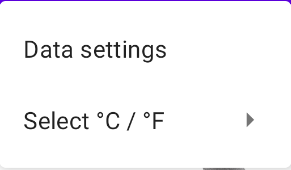
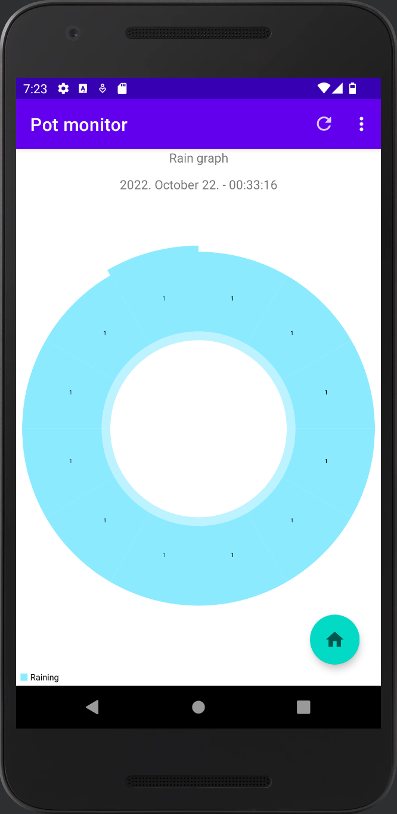

# Házi feladat specifikáció

Információk [itt](https://viauac00.github.io/laborok/hf)

## Mobil- és webes szoftverek

### 2022.10.19

### Virágcserép Monitor

### Török Álmos - (ALA54Q)

### torokalmos723@gmail.com

### Laborvezető: Püspök-Kiss Balázs

## Bemutatás

Az ablakomban saját projektként egy cserépben hagymát nevelek. Gyakorlásul és fejlesztésül csináltam hozzá egy ESP-8266 alapú wifis mérőmodult, ami mér hőmérsékletet, páratartalmat, fényt, vízszintet egy tartályban (innen lehet öntözni - todo), talajnedvességet és hogy esik-e. Ezt egy szerver wifin rögzíti és ezeknek az adatoknak egy megjelenítő platformot készítenék, ami képes mutatni az eltárolt adatokat, a kinti időjárást és átlagolja az elmúlt napok történéseit.

## Főbb funkciók

Saját szerverről egy saját websocketen adatok lekérése json formátumban. A lekért adatok grafikonon való megjelenítése. Időjárás adatok megjelenítése. Napi, heti, havi állapotjelentés.

## Választott technológiák:

- Fragmentek
- RecyclerView
- Activity
- OkHttpClient
- LineChart, PieChart
- ViewPager
- FloatingActionButton
- TimePicker, DatePicker
- LinearLayout, ConstraintLayout
- Menu

# Házi feladat dokumentáció

<h2>
Hálózati kapcsolat <b>(IMSC)</b>
</h2>

Az alkalmazás egy virágcserép adatainak lekérésére és grafikonon való megjelenítésére szolgál. Az adatokat hálózatról kéri le egy websocketen keresztül. A websocket python nyelven íródott és a 8001-es porton fogad kéréseket. A kérésekre rögtön elküldi a válaszokat. Az adatokat egy mongodb adatbázis tárolja, ahova mqtt protokollal csatlakoztatott ESP8266 szolgáltatja az adatokat. A websocket csatlakozó linkjének argumentumaival lehet beállítani a lekérendő adatokat:

<ul>
<li>id=**** : egy id-t vár, ami azonosít, e nélkül az id nélkül a websocket nem küldi el az adatokat a felhasználónak</li>
<li>num=x : argumentum egy számot (x) vár, ez azt adja meg, hogy a legutolsó hány db állapotjelentést szeretnénk lekérni a szerverről. Elhagyása esetén az összes adatot elküldi.</li>
<li>from=yyyy-mm-dd_hh:mm : parancssori argumentum a megadott év-hónap-hónapnapja_óra:perc időtől kezdődően elküldi az adatokat. Elhagyása esetén nincs alsó időhatár.</li>
<li>to=yyyy-mm-dd_hh:mm : parancssori argumentum a megadott év-hónap-hónapnapja_óra:perc időig elküldi az adatokat. Elhagyása esetén nincs felső időhatár.</li>
</ul>
Példák:
<ul>
<li>Lekérés ami a legutolsó 10 adatot kéri le: ws://10.152.69.0:8001/?id=****&num=10</li>
<li>Lekérés ami a legutolsó 12 adatot kéri le 2022. október 28. 12:38 előtt: ws://10.152.69.0:8001/?id=****&num=12&to=2022-10-28_12:38</li>
<li>Lekérés ami minden adatot lekér 2022. október 28. 00:00 és 2022. október 28. 4:00 között: ws://10.152.69.0:8001/?id=****&num=12&from=2022-10-28_00:00&to=2022-10-28_04:00</li>
</ul>
<h2>Az alkalmazás felülete</h2>

Az alkalmazás nyelve magyar és angol között a telefon beállításai szerint változik.

<h3 id="foablak">Fő ablak</h3>

Ez az ablak nyílik meg, amikor elindítjuk az alkalmazást. Mivel ez egy always-on ablaknak lett tervezve, így az időt is kijelzi. Található egy ikon jobb felül, ami lehet nap (nappal), hold (este), lámpa (este, ha fény van), vagy esőfelhő (ha esik). Található alul egy hőmérő, amitől balra található egy hőmérséklet, ami a virágcserép körüli hőmérséklet. Ez függőlegesen arányosan jelenik meg a hőmérő kép mellett, az ikon tetejénél van +50°C (122°F) az aljánál -30°C (-22°F).

Az oldal jobb alsó sarkán levő zöld gomb pedig a <a href="#diagrammok">adat megjelenítő diagramokhoz</a> vezet.

<h3>Menü</h3>

A menü az alkalmazás tetején, minden oldalon látható. Található rajta egy frissítés gomb, ez lekéri az adatokat a szerverről. Található rajta egy lenyíló menü. Itt 2 menüpont közül lehet választani, az egyik az <a href="#adat_beall">adatok beállításának</a> oldalára visz, a másiknál meg lehet adni, hogy a hőmérséklet °C, vagy °F legyen.

 

<h3>Összes adat nézet</h3>

Ha a <a href="#foablak">főablakot</a> balra húzzuk, akkor jutunk ebbe a nézetbe. Itt egymás alatt megjelenik minden adat, amit a szerverről a telefon lekért.

<h3 id="adat_beall">Adat beállítások</h3>

Ezen az ablakon tudjuk beállítani, hogy mennyi adatot és mettől meddig kérünk le. Amelyik adat mellett a rublika ki van jelölve, azt figyelembe veszi a lekérdezésnél az app. A legfelső mezőben az adatuk maximális számát lehet megadni. Alatta a kezdő, az alatt pedig a végső dátumot. A dátumok mellett található gombbal, az adott dátum a mai dátumra ugrik. A kezdő dátum nem lépheti túl a végső dátumot, illetve a végső dátum sem lehet a kezdődátum előtt, ezt az alkalmazás kezeli. A mentés gombbal a beállítások mentésre kerülnek, a mégse gobbal elvesznek és az eddigi beállítások maradnak. A mentés a SharedPreferences-be történik.

720px-nél szélesebb eszközön az idő megadására is lehetőség van.

<h3 id="diagrammok">Adat megjelenítő diagrammok</h3>

Ezeken az ablakokon diagrammok jelennek meg az adatokkal: hőmérésklet, páratartalom, fényerő, talajnedvesség, eső és víztartály szintje. A jobb alsó zöld gomb a <a href="#foablak">főablakra</a> visz.

A hőmérésklet, páratartalom, fényerő, talajnedvesség és víztartály grafikonok sima grafikonok, ha rányomunk egy adatra, akkor a grafikon felett látható lesz a rögzítés dátuma. Az eső diagram egy kördiagram, ami a lekért időszakban az esőzéseket mutatja. Ha nem volt eső, akkor nem jelenik meg diagram. Itt is a diagram egy adott szelete megadja az esőzés rögzítésének dátumát.

 

